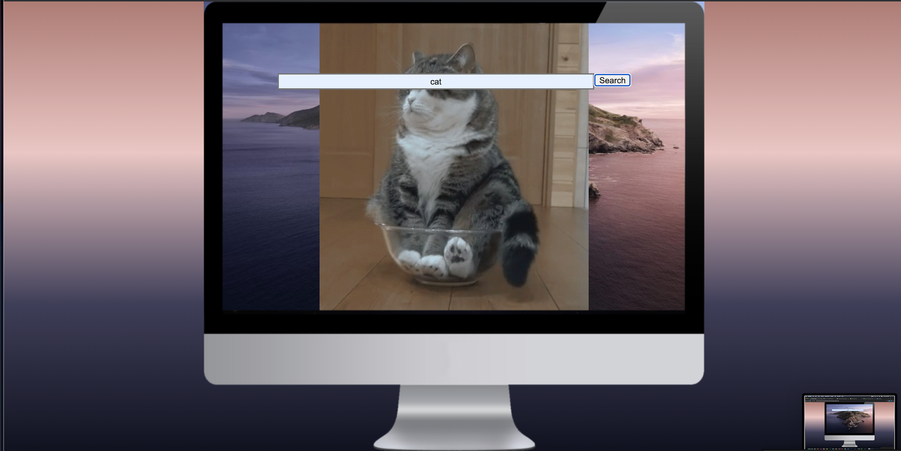

A Giphy inspired project where users can input their search requests in a "computer" and have their giphy results show up on the false-computer screen with API from Giphy.
User can change input in search bar to show a new giphy.

Deployed Application: 
https://maddym0.github.io/Giphy-Generator/

(Insert Giphy idea here)

Giphy search now feautured on false-computer screen .

*Technologies Used*
<ul>
<li>HTML</li>
<li>CSS</li>
<li>Javascript</li>
<li>JQuery</li>
</ul>

*Future Enhancements*
<ul>
<li>Adding more gifs to be feautured on screen</li>
<li>Screen able to have a scrolling option</li>
<ul>